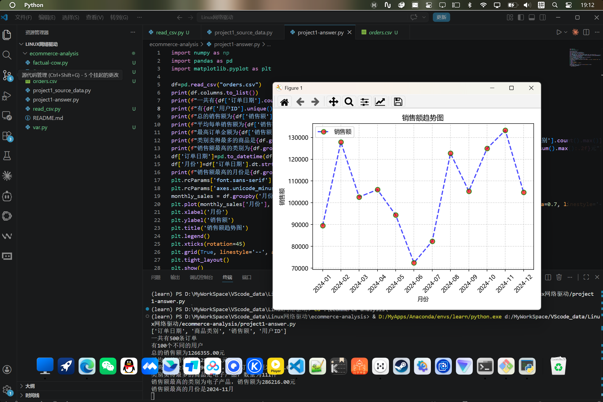

# 电商订单数据分析

## 📋 项目简介

本项目是一个电商订单数据分析系统，通过对模拟订单数据的深入分析，回答关键业务问题，发现销售规律，为电商运营决策提供数据支持。

## 📊 数据来源

- **数据类型**：模拟生成的电商订单数据
- **时间范围**：2024年1月 - 12月
- **数据规模**：500条订单记录
- **包含字段**：订单ID、用户ID、商品类别、销售额、订单日期等

## 🔍 分析内容

### 1. 数据概览
- 订单总数统计
- 活跃用户数
- 总销售额
- 平均订单金额

### 2. 商品类别分析
- 各类别销售数量排名
- 各类别销售额排名
- 类别销售占比分析
- 热销商品类别识别

### 3. 时间趋势分析
- 月度销售额趋势
- 季度性销售规律
- 销售高峰期识别
- 时间序列可视化

### 4. 用户分析
- 消费金额TOP 5用户
- 用户消费分布
- 高价值用户识别
- 用户购买频次分析

## 🛠️ 技术栈

| 技术 | 版本 | 用途 |
|------|------|------|
| Python | 3.11+ | 核心编程语言 |
| Pandas | 最新 | 数据处理与分析 |
| Matplotlib | 最新 | 数据可视化 |
| NumPy | 最新 | 数值计算 |

## 📦 项目结构

```
ecommerce-analysis/
├── README.md                            # 项目说明文档
├── project1_source_data.py              # 源csv数据创建脚本
├── project1-answer.py                   # 电商数据分析脚本
├── data/
│   └── orders.csv                       # 订单数据文件
└── 运行结果.png
```

## 🚀 快速开始

### 环境要求
- Python 3.11 或更高版本
- pip 包管理工具

### 安装依赖

```bash
pip install numpy pandas matplotlib
```

### 运行分析

```bash
python project1-answer.py
```

运行后会生成分析报告和可视化图表。

## 📈 分析成果展示



## 📈 输出结果

脚本执行完成后，将生成：
- 控制台输出：数据统计摘要
- 图表文件：销售趋势、类别分析等可视化
- 报告文件：完整的分析报告

## 📝 主要功能

### 数据加载与清洗
```python
# 加载订单数据
df = pd.read_csv('data/orders.csv')
# 数据类型转换和清洗
```

### 统计分析
- 描述性统计
- 聚合分析
- 排序与排名

### 数据可视化
- 条形图：类别销售对比
- 折线图：时间趋势
- 饼图：销售占比
- 柱状图：用户消费分布

## 💡 业务洞察

通过本分析，可以获得以下业务洞察：
- 🎯 识别最有潜力的商品类别
- 📅 发现销售季节性规律
- 👥 定位高价值客户群体
- 📈 优化库存和营销策略

## 🔄 后续改进

- [ ] 支持实时数据更新
- [ ] 添加更多高级统计模型
- [ ] 构建交互式仪表板（Streamlit/Dash）
- [ ] 客户生命周期价值（CLV）分析
- [ ] 预测性分析与销售预测

## 📄 许可证

MIT License

## 👤 作者

mlyl-ovo

## 📞 联系方式

如有问题或建议，欢迎提出Issue或联系作者。

---

**最后更新**：2026年4月19日
